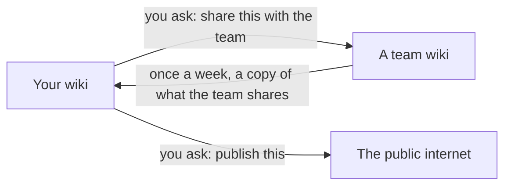

# How your wiki works

Three questions come up more than any others. Who can see my pages? What happens when Claude asks
"Shall I merge this?" And how does anything get to my team? This page answers all three, in plain words.

You never need any technical knowledge for this. You say what you want, and Claude does the rest.

*This page is the same in every wiki. If you're reading it in a team wiki, "your wiki" means your own
personal one. The technical version is in `TECHNICAL.md`, and you don't need it.*

---

## Three places your writing can be

- **Your wiki.** Your own space. Everything you and Claude write lives here first.
- **A team wiki** (we call these *commons*). A shared space for a team or a topic, like the xCO team
  wiki. Its members can all read it.
- **The public internet.** Only if you choose to publish something.

Nothing moves between these on its own. Every step happens because someone asked for it.

---

## Who can see your pages

Every page has a **label** that says how far it's allowed to travel.

| Label | Who it's for | Can it go to your team? | Can it go on the internet? |
| --- | --- | --- | --- |
| **`private`** | Just you | No | No |
| **`internal`** | You and your colleagues | Yes, if you ask | No |
| **`unlisted`** | Anyone with the link | Yes, if you ask | Yes, but hidden from search |
| **`public`** | Anyone | Yes, if you ask | Yes |

**Every new page starts as `private`.** That's the safe choice. You can always open a page up later, but
you can't take back something once it's been shared.

**To change a label, just say so:** *"make this page internal."* Claude never changes a label on its own.

**What to use when:**

- **`private`** for anything personal or sensitive: people and contacts, money and deals, meeting
  transcripts, and ideas you haven't settled yet.
- **`internal`** for everyday working knowledge you'd happily show a colleague. Most pages end up here.
- **`unlisted`** for work in progress you want to show someone outside, by sending them the link.
- **`public`** for finished work you'd put your name to in public.

**The one thing labels can't do.** A label controls where a page can *travel*. It doesn't lock your wiki.
Anyone who can open your wiki can read every page in it, private ones included. That's usually just you
and a couple of Dark Matter Labs' GitHub admins. So *private* means "never shared, never published". It
doesn't mean "hidden from everyone". If something must stay hidden even from admins, keep it out of the
wiki.

---

## When Claude asks "Shall I merge this?"

While Claude works, it writes its changes into a **draft** first, so your wiki is never left half-changed.
When it's done, it tells you what changed and asks ***"Shall I merge this?"*** Merging just means
*saving the draft into your wiki*.

- **Say yes**, and it's saved. It's now part of your wiki.
- **Say no, or say nothing**, and the draft waits safely. Nothing is lost.
- **To find drafts you forgot about**, ask *"what's waiting for me?"*

**Saving never shares anything.** It only changes your own wiki. Nothing reaches your team until you ask,
as the next section explains.

And you can't break anything by saying yes. Every change is checked automatically, and any change can be
undone.

---

## Sharing something with your team

Say *"share this with the team"*, and say which page. Then Claude:

1. **Checks the label.** A `private` page can't be shared. If you want to share it, first say *"make it
   internal"*. Claude will never do that for you, because deciding a page is ready to share is your call.
2. **Makes a careful copy for the team wiki.** The copy notes where it came from and who shared it.
   Anything that points to your private pages is taken out. Nothing about money, deals or contacts can go.
3. **Sends it to the team wiki for someone else to check.** Another member of that team reviews it and
   adds it. Nobody adds their own contribution to a team wiki; that second pair of eyes is the check.

Your own page stays exactly as it was. The team wiki gets a copy.

**Sharing can't be taken back.** Once a copy has gone to the team, it can't be fully recalled. That's why
Claude goes through the copy with you before sending it.

---

## Seeing what your team knows

Once a week, your wiki quietly fetches a **copy of what each of your team wikis has shared**. You only get
the pages they've marked for colleagues or the public, never their private ones. The copy is kept separate
from your own pages, and never mixed into them.

It lets Claude compare your thinking with your team's. For example, you could ask:

- *"How does this document compare with what the team already knows?"*
- *"Is there anything in my wiki worth sharing with the team?"*

---

## Starting a team wiki

A team wiki is worth creating when **more than one person** keeps adding knowledge about the same thing,
such as a team, a programme or an xCO position. One of Dark Matter Labs' GitHub admins needs to create it
first, so ask one. Then say *"set up a team wiki for …"*, and Claude will run a short first conversation
with you about four things:

1. **What it's for**, and how you'd know in six months that it's working.
2. **Who can open it.** People are added by name, and everyone who can open it can read all of it.
3. **Where it fits:** whether it feeds into a bigger team wiki.
4. **Its first three documents**, so it has something real in it from day one.

Pages in a team wiki start as `internal`, not `private`, because a team wiki exists to be shared.

---

## Quick answers

| Question | Answer |
| --- | --- |
| Can my colleagues see my `private` pages? | Only the few who can open your wiki. Everyone else sees nothing, not even the page's name. |
| If I say yes to "Shall I merge this?", does it go to the team? | No. It's only saved in your own wiki. |
| Why won't Claude share my page? | It's `private`. Say "make it internal" first, if you're sure. |
| Who adds what I share to the team wiki? | Another member of that team. Never you, and never Claude for you. |
| I said no to saving. Is my work gone? | No. It waits. Ask "what's waiting for me?" |
| Can I take back something I shared? | Not fully. That's why Claude checks it with you first. |
| Will my team's copy change my pages? | Never. It's kept separate. |
| New team wiki, or a page in an existing one? | A team wiki if several people will keep adding to it. A page if it's one topic in existing work. |

For admins, and for how access is set up, see `SHARING-AND-ACCESS.md`.
