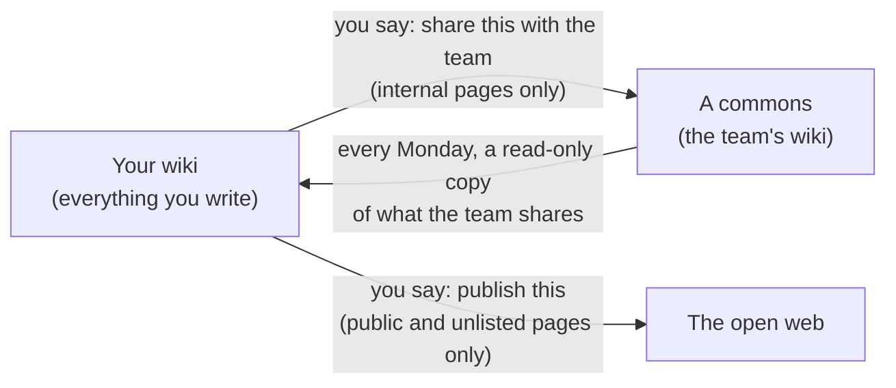

# How your wiki works: labels, drafts, and the team commons

Three questions come up more than any others. What do the labels mean? What is a branch, and what
does merging do? And how does anything get to the team? This page answers all three in plain words.
You never need git or a terminal for any of it. You say what you want, and Claude does the rest.

This page is the same in every wiki. If you are reading it in a commons, "your wiki" means your own
personal wiki.

---

## Three places your writing can be

| Place | What it is | Who can open it |
| --- | --- | --- |
| **Your wiki** | This repository. Every page you and Claude write lives here. | You, and the few people given access to this repository |
| **A commons** | A shared wiki for a team or a topic, such as `xco-team-wiki`. | Its members |
| **The open web** | A published page on the wiki's website, if it has one. | Anyone |

Nothing moves between these places on its own. Every arrow happens because someone asked for it.

---

## The four labels

Every page carries one label, called its **visibility**. The label decides **how far a page is allowed to
travel**. It does not hide a page from people who can already open your wiki.

| Label | Can it go to a commons? | Can it go on the open web? | Use it for |
| --- | --- | --- | --- |
| **`private`** | No, never | No, never | Anything personal or sensitive: relationships and contacts, money and deals, meeting transcripts, positions you haven't settled |
| **`internal`** | Yes, when you ask | No, never | Ordinary working knowledge you'd happily show a colleague |
| **`unlisted`** | Yes, when you ask | Only by direct link, never listed or searchable | Work in progress you want to show someone outside |
| **`public`** | Yes, when you ask | Yes | Finished work you'd put your name to in public |

**New pages start as `private`.** That is the safe default. Moving a page up is one sentence, and moving a
page down after it has been shared is impossible.

**To change a label, just say so:** *"make this page internal"*. Claude will not raise a label on its own.

**The one thing labels cannot do.** Anyone who can open your wiki can read every page in it, `private`
included. GitHub gives access to a whole repository, not to single pages, and people who run the
organisation can open any repository in it. So `private` means *never shared, never exported, never
published*. It does not mean *hidden from everyone*. If something must be hidden from the people who can
open this wiki, it should not be in the wiki.

---

## Drafts, merging, and `main`

Three words, and what they mean here:

- **`main`** is your wiki: the version everyone reads, and the one every tool works from.
- **A branch** is a draft copy Claude makes while it works, so nothing is half-changed while you watch.
- **A pull request** is the proposal to put that draft into `main`. **Merging** accepts it.

**In your own wiki, you won't usually do any of this yourself.** When Claude finishes a piece of work, it
tells you in plain words what changed and asks *"Shall I merge this?"*

- **Say yes**, and the change goes into `main`. It is now part of your wiki.
- **Say no, or say nothing**, and the draft waits safely. Nothing is lost.
- **To find drafts you forgot about**, say *"what's waiting for me?"*

**Merging does not share anything.** It only changes your own wiki. Nothing reaches the team until you
ask for it, as the next section explains.

Every merge can be undone on its own, and automatic checks run before anything lands, so you cannot
break the wiki by saying yes.

---

## Sharing with the team

Say *"share this with the team"*, and name the page. Claude then:

1. **Checks the label.** A `private` page is refused outright. If you want it shared, first say *"make
   it internal"*. Claude will never do that step for you, because deciding a page is fit to share is
   yours to decide.
2. **Makes a clean copy for the commons.** It carries a note of where it came from and who contributed
   it. Anything linking to your private pages is removed, and nothing about money, deals or contacts
   can go.
3. **Opens a pull request in the commons.** **Another member of the commons reviews it and merges it.**
   Nobody merges their own contribution into a commons. That second person is the check.

Your own page stays in your wiki, unchanged. The commons gets a copy.

**Sharing cannot be taken back.** Once a copy has been sent to the commons, closing the pull request does
not remove it. That is why Claude reads the copy with you before it goes.

---

## Reading what the team knows

Every Monday your wiki fetches a **read-only copy** of what each commons it reads has shared: its
`internal`, `unlisted` and `public` pages, never its private ones. The copy is kept apart from your pages
and is never mixed into them.

It is there so Claude can **compare** your thinking with the team's. For example:

- *"Where does this document sit against what the team already knows?"* measures agreement and
  disagreement.
- *"Is anything here worth sharing with the team?"* finds pages the commons doesn't have yet.

Your wiki's settings say which commons it reads from, and which it may contribute to. They can be
different: a wiki can read a commons without ever sending anything to it.

---

## Starting a commons

A commons is worth creating when **more than one person** is building knowledge about the same thing, such
as a team, a programme, or an xCO position. Creating the repository needs an organisation admin, so ask one
first. Then say *"set up a commons for …"*, and Claude runs a short first session with you. It covers four
things:

1. **What it is for**, and how you would know in six months that it worked.
2. **Who may open it.** Access is given to named people. Everyone who can open it can read all of it.
3. **Where it sits:** which larger commons it contributes to, if any.
4. **Its first three sources**, so it holds something real from day one.

Pages in a commons start as `internal`, not `private`, because a commons exists to be shared with its
members.

---

## Quick answers

| Question | Answer |
| --- | --- |
| Can my colleagues see my `private` pages? | Only the ones who can open your wiki. Everyone else sees nothing, not even the title. |
| If I say yes to "Shall I merge this?", does it go to the team? | No. It only goes into your own wiki. |
| Why was my page refused when I asked to share it? | It is `private`. Say "make it internal" first, if you're sure. |
| Who merges what I share with the team? | Another member of the commons. Never you, and never Claude on your behalf. |
| I said no to a merge. Is the work gone? | No. It waits. Say "what's waiting for me?" |
| Can I undo something I shared? | Not fully. That is why Claude checks with you before it goes. |
| Does the team's copy change my pages? | Never. It is read-only and kept apart. |
| Should this be a new commons or a page in an existing one? | A commons, if several people will keep adding to it. A page, if it is one topic within existing work. |

For the technical detail behind the labels, and how access is set up, see `SHARING-AND-ACCESS.md`.
